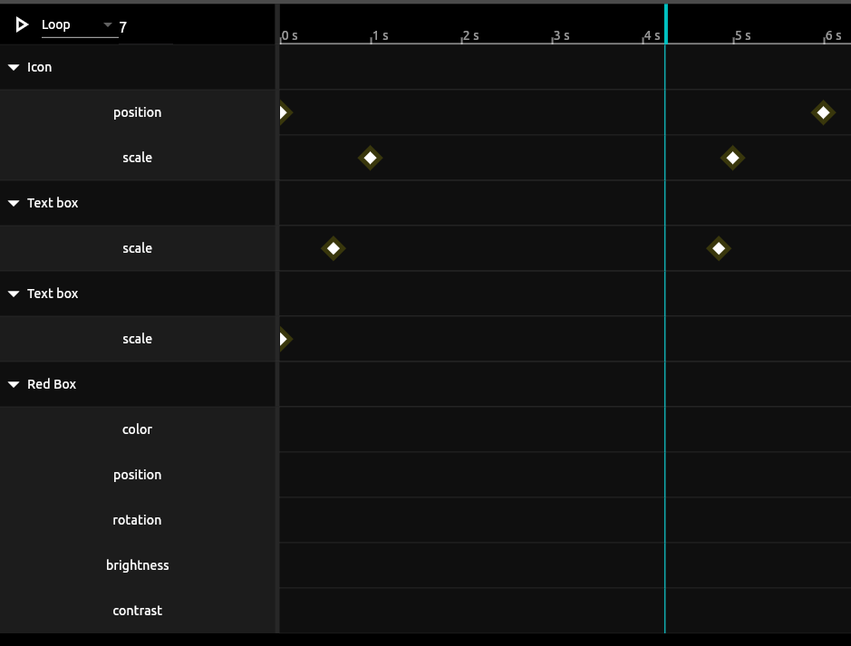

<!--  -->

<!-- 
<a href='https://docs.flutter.dev/packages-and-plugins/favorites'></img></a> -->

Flutter Animation editor
================================================================================

A flexible keyframe based animation editor in flutter which allows you to define tracks and keframes data just like animation softwares like rive, blender, unity etc.

1. dynamically add tracks for any object id,
2. Easy easily add keyframes for different properties of that object
3. custom property name it anything you want position, scale, angle, color etc.
4. playback options loop, one shot, ping pong.
5. change animation duration.
6. more to come.

All via a simple unified api

<!--  -->

